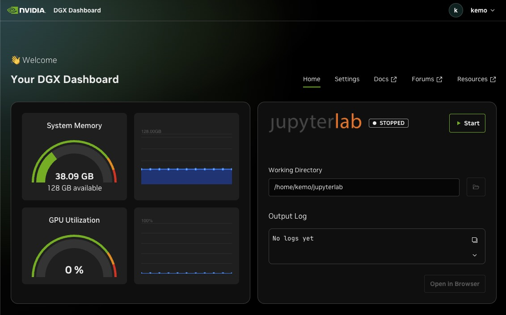

# DGX Dashboard Proxy

When using NVIDIA Sync, you can access the DGX Dashboard remotely from your desktop.



It does this by creating an SSH tunnel that can access the port 11000 on the DGX system.

The Dashboard is controlled by a SystemD service and there's no way to get it to listen on a wider address list than just localhost.

This presents a problem if you want to access it via something like Traefik or just remotely in general without NVIDIA Sync or setting up your own SSH tunnel.

To get around this, I used `socat` and a SystemD service to redirect things which lets it be accessible to Traefik.

```bash
# Install socat
sudo apt install socat -y

# Get the SystemD service
sudo curl -o /etc/systemd/system/dgx-dash-proxy.service https://raw.githubusercontent.com/kenmoini/lab-dgx-spark/refs/heads/main/setup/dgx-dash-proxy/dgx-dash-proxy.service

# Reload systemd
sudo systemctl daemon-reload

# Enable and start the service
sudo systemctl enable --now dgx-dash-proxy
```

By default it will proxy the Dashboard from `127.0.0.1:11000` to `0.0.0.0:11001`.

This let's you add the following Traefik dynamic configuration to access the dashboard remotely:

```yaml
# /opt/workdir/mgmt/dynamic/dgx-dashboard.yml
http:
  routers:
    dgxdashboard:
      rule: "Host(`dgx-dashboard.YOUR_SPARK_IP.traefik.me`)"
      service: dgxdashboard
      entrypoints:
        - web
        - websecure

  services:
    dgxdashboard:
      loadBalancer:
        servers:
          - url: "http://YOUR_SPARK_IP:11001" # This is the IP of the DGX Spark
```

## Homepage Configuration

In case you're also using Homepage as a landing page for things, this is how you'd include the DGX Spark Dashboard as a link option:


```yaml
---
# For configuration options and examples, please see:
# https://gethomepage.dev/configs/services/
- Management:
  - DGX Dashboard:
      href: https://dgx-dashboard.YOUR_SPARK_IP.traefik.me/
      description: DGX Dashboard for JupyterHub and basic system monitoring and management
      icon: nvidia.png
```
